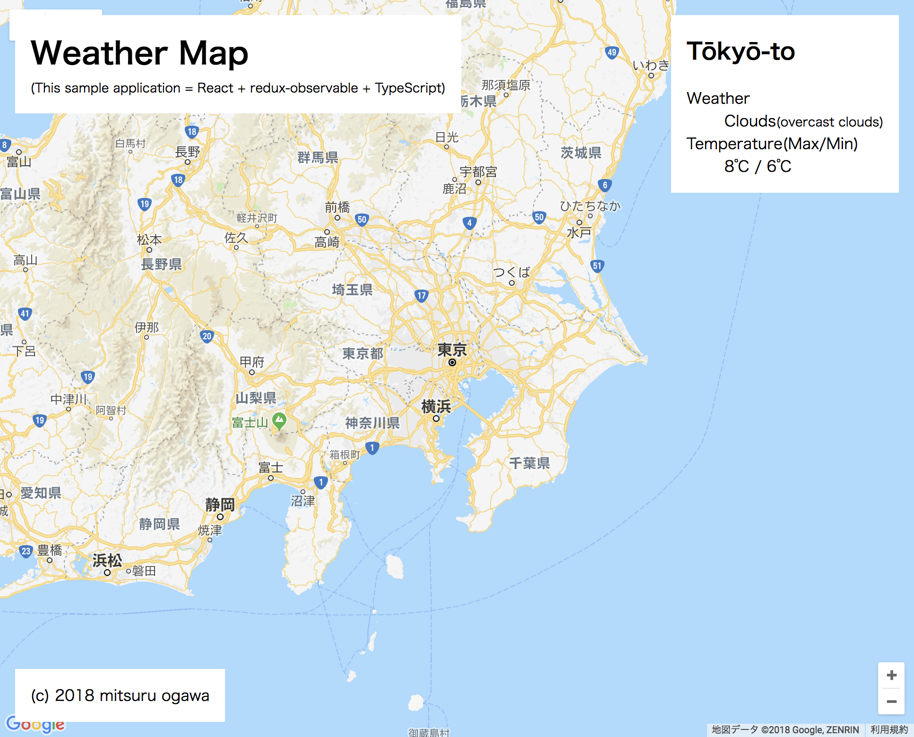

# react-redux-observable-typescript-sample

A sample application for React + redux-observable + TypeScript



## Installing / Getting started
   
```
npm start 
```

Now open up `index.html` in your favorite browser and everything should be ready to use!
## Licensing

MIT
